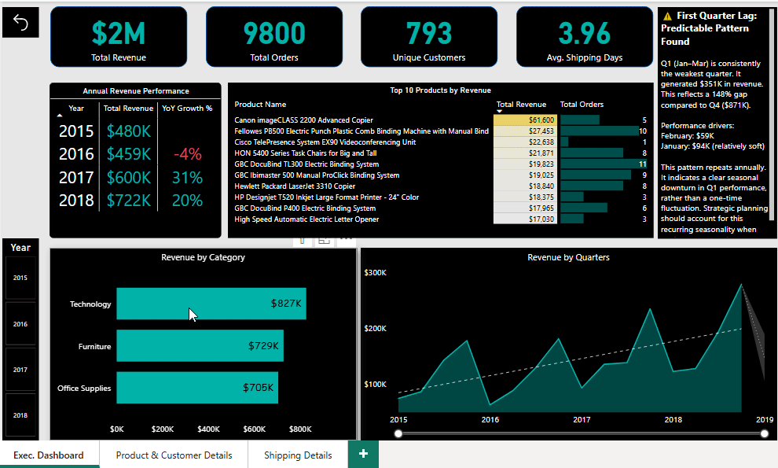
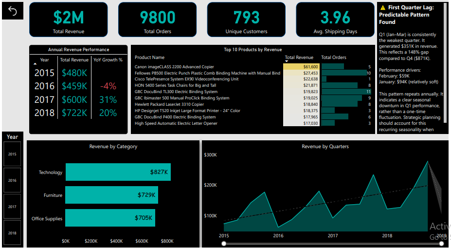
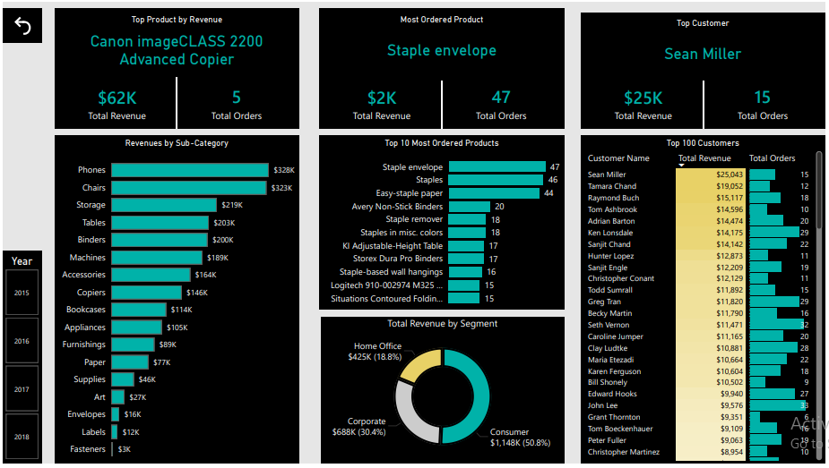
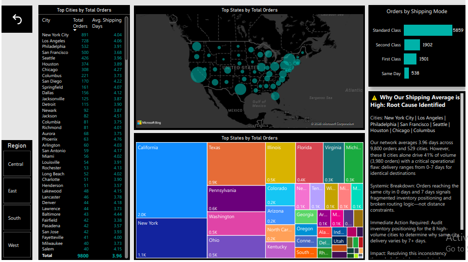

# Superstore Sales Power BI Dashboard

# Superstore Sales Power BI Dashboard

## Project Overview
An end-to-end business intelligence solution analyzing four years of retail sales data (2015–2018). Designed with a high-contrast, dark-mode interface to reduce eye fatigue during deep analysis, this dashboard goes beyond surface-level metrics to uncover operational bottlenecks and seasonal revenue patterns across $2M in total sales, 9,800 orders, and 793 unique customers.

## Key Findings

**The Q1 Revenue Lag**
Q1 consistently underperforms Q4 by 148% annually (e.g., Q1 generating $351K vs. Q4 generating $871K). This is a predictable, recurring seasonal downturn that requires proactive strategic planning and marketing adjustments in early-year months.

**Segment & Product Disconnect**
The Consumer segment drives the majority of the business, accounting for 50.8% ($1.14M) of total revenue. Interestingly, while high-ticket Technology items like the Canon imageCLASS 2200 Advanced Copier drive the highest gross revenue ($62K), the highest order volume comes from low-margin basic office supplies like staple envelopes and binders.

**Systemic Shipping Inefficiencies**
Despite an overall average shipping time of 3.96 days, a critical root cause analysis revealed severe inventory fragmentation. Eight major cities (including New York City, Los Angeles, and Philadelphia) drive 41% of the total order volume but experience erratic delivery ranges from 0 to 7 days for identical destinations. 

## Data Architecture & Modeling
Behind the visuals lies a highly optimized, structured relational database environment designed for rapid query performance and DAX measure evaluation:
- **Star Schema Design:** Deployed a central Fact Table (Orders) surrounded by localized Dimension Tables (Customers, Products, Geography, Calendar) to ensure efficient data filtering and drill-down capabilities.
- **Data Transformation (Power Query):** Cleaned raw datasets by enforcing strict data typing, removing duplicate records, and extracting granular date hierarchies for the time-intelligence calculations.
- **DAX Implementation:** Engineered complex logic including Year-over-Year (YoY) growth tracking, dynamic average shipping calculations, and conditional formatting rules for visual performance indicators.

## Tools Used
- **Microsoft Power BI Desktop:** Visual rendering and dashboard deployment.
- **DAX:** Advanced analytical calculations and measure creation.
- **Power Query:** ETL (Extract, Transform, Load) processes.
- **Microsoft Excel:** Raw data storage and preliminary exploration.

## Visual Walkthrough & Previews

### 1. Executive Overview

### 2. Product and Customer Segmentation

### 3. Geographic and Logistics Analysis

### 4. Relational Data Model

### Dashboard Video Walkthrough

<video src="https://raw.githubusercontent.com/YOUR_GITHUB_USERNAME/YOUR_REPOSITORY_NAME/main/PBIDesktop_nXvI6KTIzx.mp4" controls width="100%" poster="1.PNG">
  Your browser does not support the video tag. You can view the recording directly in the repository files.
</video>
